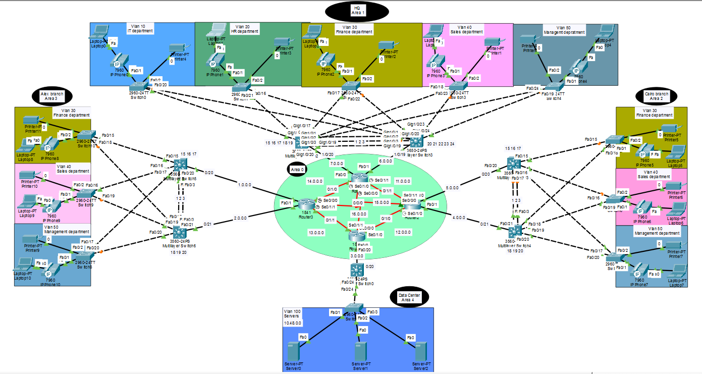
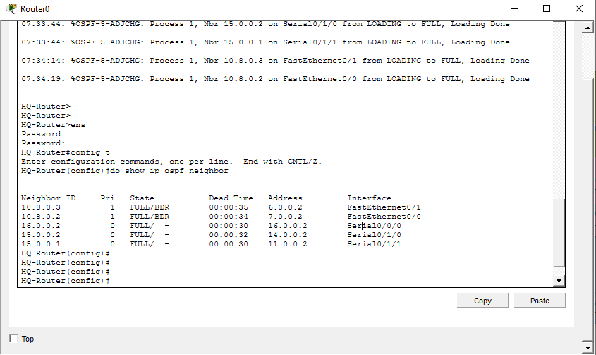
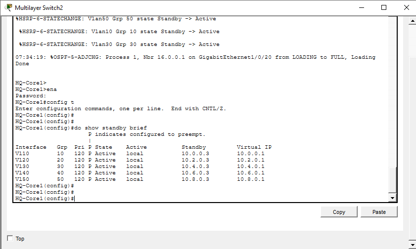
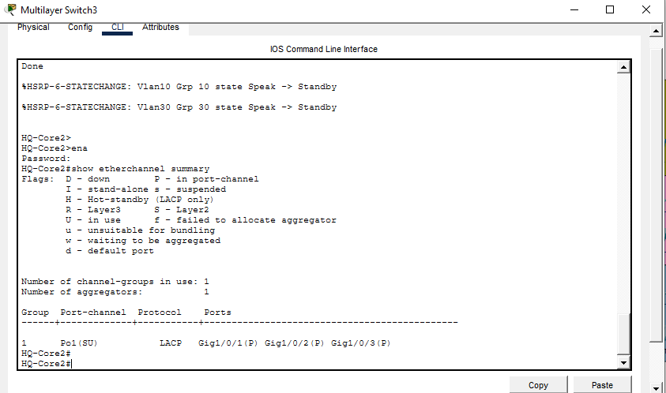
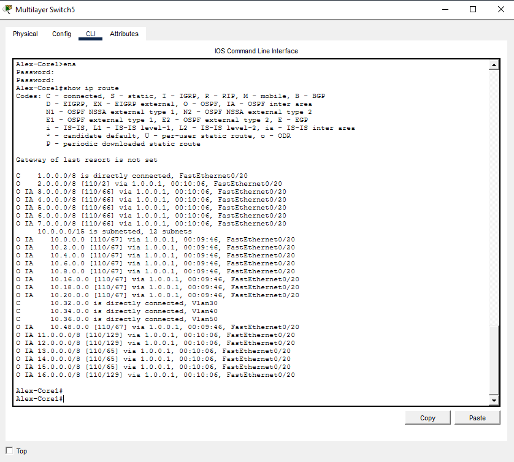
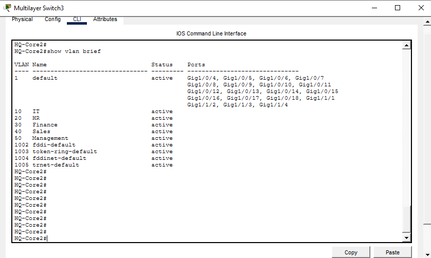
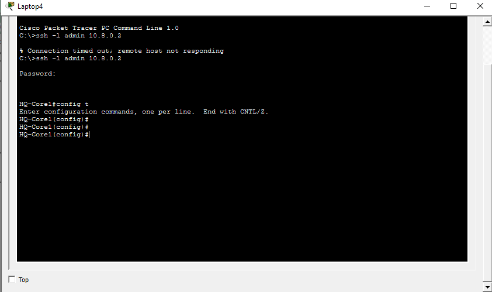
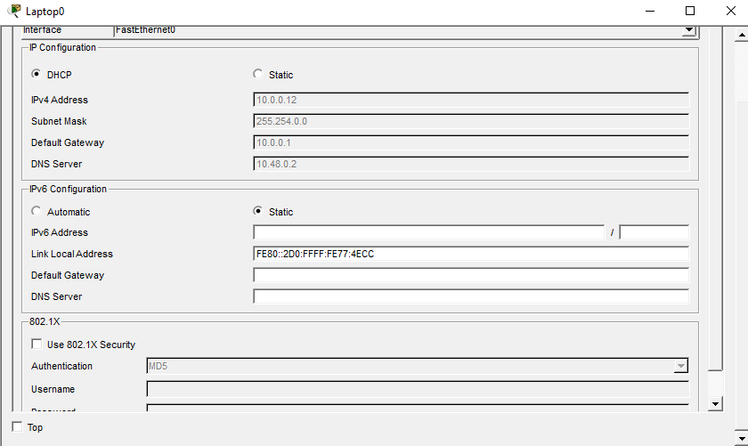
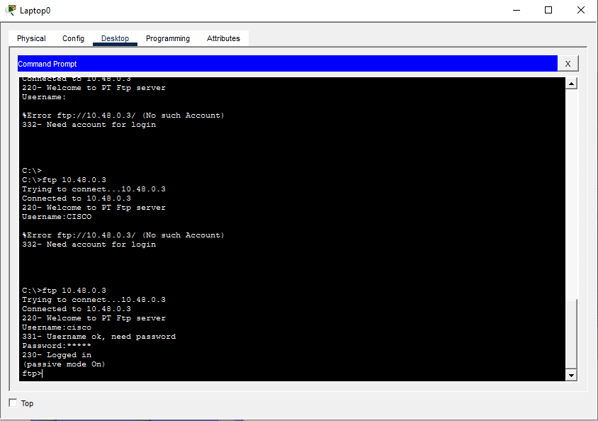
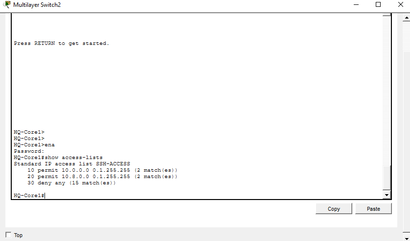

# 🌐 Infinity Core Enterprise Network

> A complete enterprise-grade network infrastructure designed and implemented using Cisco Packet Tracer.



---

# 📖 Overview

**Infinity Core** is a full enterprise network simulation that demonstrates how modern organizations design secure, scalable, and highly available infrastructures.

The network consists of:

- 🏢 Headquarters (HQ)
- 🏙 Cairo Branch
- 🌊 Alexandria Branch
- 🖥 Data Center
- 🌍 ISP Transit Core

The project integrates Layer 2, Layer 3, redundancy, dynamic routing, centralized services, and network security into one enterprise topology.

---

# 🎯 Project Objectives

- Design a scalable enterprise architecture.
- Implement Multi-Area OSPF routing.
- Build a redundant gateway using HSRP.
- Segment departments using VLANs.
- Enable secure remote administration.
- Deploy centralized network services.
- Apply enterprise security best practices.

---

# 🏗 Network Architecture

```
                    Headquarters
                         │
            ┌────────────┴────────────┐
            │                         │
     Cairo Branch              Alexandria Branch
            │                         │
            └────────────┬────────────┘
                         │
                   ISP Transit Core
                         │
                    Data Center
```

---

# 🖥 Infrastructure

## Headquarters

| VLAN | Department | Network |
|------|------------|---------------|
|10|IT|10.0.0.0/15|
|20|HR|10.2.0.0/15|
|30|Finance|10.4.0.0/15|
|40|Sales|10.6.0.0/15|
|50|Management|10.8.0.0/15|

---

## Cairo Branch

| VLAN | Department |
|------|------------|
|30|Finance|
|40|Sales|
|50|Management|

---

## Alexandria Branch

| VLAN | Department |
|------|------------|
|30|Finance|
|40|Sales|
|50|Management|

---

## Data Center

| VLAN | Purpose |
|------|---------|
|100|Enterprise Servers|

---

# 🚀 Technologies Implemented

### Routing

- ✅ Multi-Area OSPF

### Switching

- ✅ VLAN Segmentation
- ✅ Inter-VLAN Routing (SVIs)
- ✅ EtherChannel
- ✅ VTP

### High Availability

- ✅ HSRP Gateway Redundancy

### Network Services

- ✅ DHCP
- ✅ DHCP Relay
- ✅ DNS
- ✅ HTTP
- ✅ FTP
- ✅ Email
- ✅ NTP

### Security

- ✅ SSH
- ✅ Port Security
- ✅ ACLs
- ✅ Local User Authentication
- ✅ Enable Secret
- ✅ Password Encryption
- ✅ Banner MOTD

---

# 🔍 Verification

## Network Topology


---

## OSPF Neighbors



---

## HSRP Status



---

## EtherChannel



---

## Routing Table



---

## VLAN Configuration



---

## Secure SSH Access



---

## DHCP Service



---

## Enterprise Web Server


---

## FTP Server



---

## Access Control Lists



---

# 🛠 Skills Demonstrated

- Enterprise Network Design
- Layer 2 Switching
- Layer 3 Switching
- Dynamic Routing
- High Availability
- Network Security
- ACL Design
- VLAN Implementation
- DHCP Deployment
- DNS Configuration
- FTP Services
- Email Services
- Secure Remote Management
- Enterprise Troubleshooting

---

# 📂 Repository Structure

```
Infinity-Core-Enterprise-Network/
│
├── Infinity-Core.pkt
├── README.md
│
├── configs/
│
└── screenshots/
```

---

# 👨‍💻 Author

**Mohamed Amr**

Faculty of Computers and Artificial Intelligence  
Cairo University

**CCNA Certified**

Interested in:

- Cloud Computing
- Networking
- Cybersecurity

---

⭐ If you found this project interesting, consider giving it a star.
